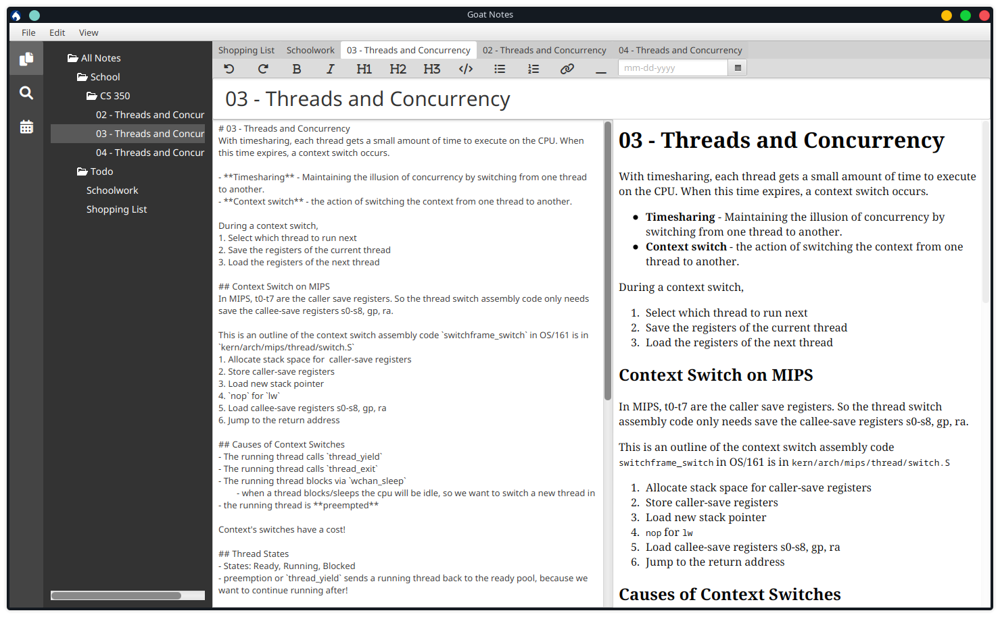
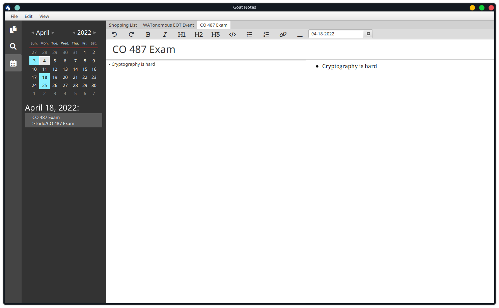
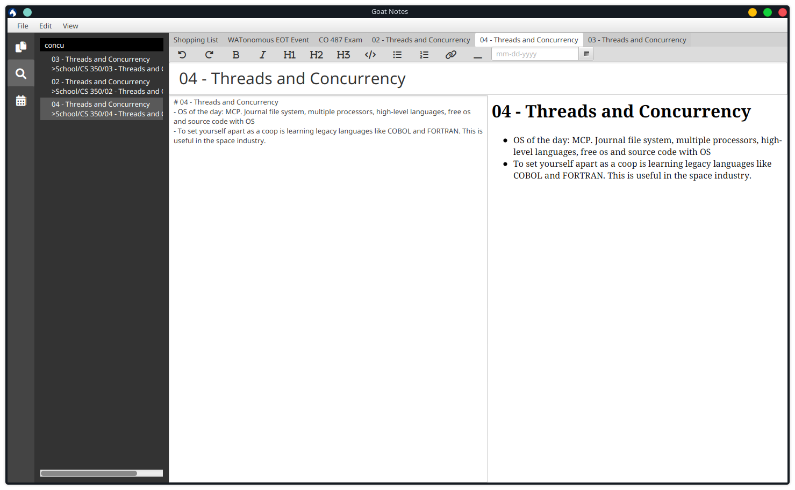

# Goat Notes
## Description
**Goat Notes** is a feature-rich markdown note-taking app. It supports multiple tabs, calendar view for notes, folder structure, self-hosted syncing service, and much more.

**Goat Notes** was created for a course, CS 398, at the University of Waterloo. Our meeting minutes are stored [here](https://docs.google.com/document/d/1cpyGvni0LjX8X7oWMSZqOcB1BGYvsetH6brLpGMHHPU/edit?usp=sharing).

The authors of Goat Notes are Team 209: Jusdeep Dhaliwal, Jeffery Li, Abhay Sharma, and Philips Xu.

Our [wiki](https://git.uwaterloo.ca/j2372li/cs398-project/-/wikis/home) contains installation instructions, usage instructions, meeting minutes and information on our releases.

## Installation Instructions
1. Download the [installer]() from the repository
2. Click on the installer to install the Goat Notes.

## Usage Instructions
### Keyboard Shortcuts
Note: On Mac OS, use the `Cmd` key instead of `Ctrl` key.

- General
  - New Note - `Ctrl-N`
  - Switch to calendar navigation view - `Ctrl-Shift-C`
  - Switch to note navigation view - `Ctrl-Shift-E`
  - Switch to search navigation view - `Ctrl-Shift-F`
  - Delete note/folder selected in navigation view - `Delete`
  - Rename note/folder selected in navigation view - `Enter`
- Tabs
  - Close tab - `Ctrl-W`
  - Go to next tab - `Ctrl-Tab`
  - Go to previous tab - `Ctrl-Shift-Tab`
- Editor
  - Bold - `Ctrl-B`
  - Italics - `Ctrl-I`
  - Undo - `Ctrl-Z`

### Calendar
To use the calendar view, first we need to set a date using the date picker in the note editor toolbar. After doing this, we can click on the date the note is tagged with in the calendar view to see a list of all the notes tagged with that date.

### Sync Service
- Ensure that you have the sync service running.
- Click `File > Push Notes` to push your local notes and folders to the remote sync service.
- Click `File > Pull Notes` to overwrite your local notes with the remotes stored on the remote sync service.

## Screenshots
The calendar view for keeping due dates and to-do lists in order.

The search view for searching through your notes.

## Acknowledgements
We have listed our acknowledgements in our [wiki](https://git.uwaterloo.ca/j2372li/cs398-project/-/wikis/acknowledgements).

## License
This project is licensed under the [MIT License](./LICENSE.txt).
